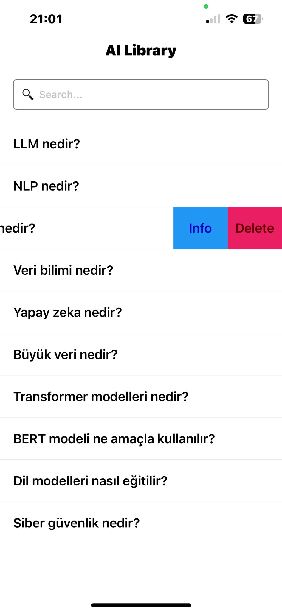

# AI Library




Bu proje, yapay zeka ve doğal dil işleme konularında bir kütüphane sunmaktadır. İçerisinde, yapay zeka ve doğal dil işleme konularında sıkça kullanılan terimlerin açıklamalarını içeren bir veritabanı bulunmaktadır. Ayrıca, bu terimlerin listelendiği bir arayüz sunulmaktadır.

## Özellikler

- Yapay zeka terimleri ve açıklamalarını içeren kapsamlı bir veritabanı.
- Terimlerin listelendiği bir arayüz.
- Terimlerin detaylı açıklamalarını gösteren bir görüntüleme özelliği.
- Terimleri arama ve filtreleme imkanı.

## Kullanım

Proje kullanımı oldukça basittir. Öncelikle projeyi klonlayın:

```bash
git clone https://github.com/kullaniciadi/AI-Library.git
```
Daha sonra, proje dizinine gidin ve gerekli bağımlılıkları yükleyin:
```bash

cd AI-Library
npm install
```
Projeyi başlatmak için:
```bash
npm start
```
